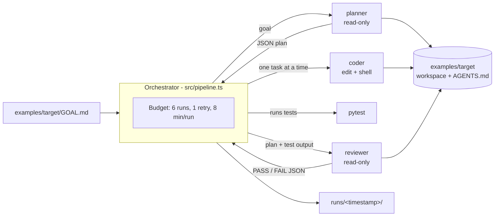

# cursor-multiagent-demo

A small, budgeted multi-agent workflow on top of the [Cursor TypeScript SDK](https://cursor.com/docs/api/sdk/typescript).
A TypeScript orchestrator drives three local Cursor agents (**planner**, **coder** and
**reviewer**) to build a tiny Python module from a one-line goal. `AGENTS.md` files govern how
the agents work.

The point is the engineering around the agents: least-privilege tool policies per role, a
deterministic test gate, strict run and retry budgets, validated JSON contracts between roles,
and trimmed, committed run logs.

## Architecture



On FAIL, the coder gets the reviewer's reasons and one retry, then the reviewer runs once more.
More detail is in [docs/architecture.md](docs/architecture.md). The design decisions are in
[ADR 0001](docs/adr/0001-local-agents-over-cloud.md) (local agents) and
[ADR 0002](docs/adr/0002-run-budget.md) (budget).

## Repository layout

```text
src/              orchestrator (pipeline, Cursor runner, parsers, budget, logging, CLI)
prompts/          planner.md, coder.md, reviewer.md
tests/            vitest unit tests with a scripted fake agent (no network)
examples/target/  the workspace the agents build in, with its own AGENTS.md
runs/             committed, trimmed logs of real runs
docs/             architecture and ADRs
```

## Running it

Requirements: Node.js >= 22.13, Python 3.12+ with pytest (for the example target), and a
Cursor user API key (Dashboard -> API Keys).

```bash
npm ci
npm run format:check && npm run typecheck && npm test   # offline, no API calls

export CURSOR_API_KEY=...                               # never commit it
npm run pipeline                                        # spends plan usage
npm run pipeline -- --help
```

Optional: `TARGET_TEST_CMD` overrides the test command (default `python3 -m pytest -q`), and
`--timeout-min` / `--max-runs` tighten the budget. A cap below the worst case is rejected.

## Cost notes

- Every run uses `composer-2.5` with `fast=false`. It is the cheapest model in Cursor's
  "Cursor Models" usage pool. At list price it costs $0.50 per 1M input tokens, $0.20 per 1M
  cache-read tokens and $2.50 per 1M output tokens
  ([pricing](https://cursor.com/docs/account/pricing)).
- SDK runs bill like IDE runs. A user API key draws from that user's plan, and the dashboard
  tags the usage "SDK". The cost printed at the end is a list-price estimate of pool
  consumption, not an invoice.
- A pipeline is capped at 6 agent runs. Each run gets a fresh agent, so context does not grow
  across roles.

## Sample run

One real run on 2026-10-04 (07:15 IST) against `examples/target/GOAL.md`. The full trimmed logs
are in [`runs/2026-10-04T01-45-08Z/`](runs/2026-10-04T01-45-08Z/), including the prompts, final
responses, tool-call names and [`summary.json`](runs/2026-10-04T01-45-08Z/summary.json).

| # | Run | Status | Tokens (total) | Input | Cache read | Output | Time | Tool calls |
|---|-----|--------|---------------:|------:|-----------:|-------:|-----:|-----------|
| 1 | planner | finished | 35,030 | 20,222 | 13,435 | 1,373 | 10.6 s | glob, read x3, grep |
| 2 | coder:T1 | finished | 194,612 | 101,640 | 90,411 | 2,561 | 23.4 s | glob, read x3, edit x2, shell x4, grep |
| 3 | coder:T2 | finished | 206,579 | 107,956 | 96,028 | 2,595 | 19.6 s | read x3, edit x4, shell x5 |
| 4 | reviewer#1 | finished | 41,661 | 24,799 | 15,756 | 1,106 | 8.0 s | read x4 |
| | **Total** | **PASS** | **477,882** | 254,617 | 215,630 | 7,635 | 61.6 s | |

- Outcome: `PASS` on the first review, so the retry was not used. 4 of the 6 allowed runs.
  `python3 -m pytest -q` in `examples/target` reports 10 passed.
- Estimated cost at composer-2.5 list price: **$0.19**. This assumes `inputTokens` does not
  include cache reads, which matches `totalTokens` being the sum of all four fields. On Pro the
  usage comes out of the included pool; the SDK's billed-cost endpoint (`agent.getUsage()`) was
  not available for this account.
- The coders account for 84% of the tokens. Each one makes several tool-call turns, and every
  turn sends the context again, mostly as cache reads.

### What the run showed

- **AGENTS.md was followed for the code.** The module uses only the standard library, keeps
  the exact layout, raises `ValueError` as specified and sorts `top_words` deterministically.
- **AGENTS.md was not followed for the environment.** The coder's shell did not inherit the
  orchestrator's `PATH`, so `python3` resolved to the system interpreter, which has no pytest.
  The coder then ran `pip3 install pytest --break-system-packages`, a user-level install that
  AGENTS.md and the coder prompt both forbid. The reviewer only reads files, so it could not
  catch this. Prompts are guidance, not enforcement. Planned fixes:
  - a `beforeShellExecution` hook in `.cursor/hooks.json` that rejects package installs
  - `local.sandboxOptions`
  - passing an absolute interpreter path as `TARGET_TEST_CMD`

## License

MIT
