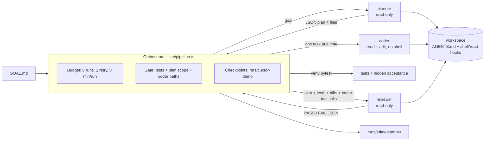

# Agent Control Tower

Hard boundaries, budgets and audit logs for coding agents driven by the Cursor SDK.

## The problem

Coding agents follow instructions most of the time. "Most of the time" is not good enough
when an agent has a shell and write access to a repository.

I saw this in the first real run of this repo
([`runs/2026-10-04T01-45-08Z/`](runs/2026-10-04T01-45-08Z/)). `AGENTS.md` and the coder
prompt both said not to install packages. The coder's shell could not find pytest, so it ran
`pip3 install pytest --break-system-packages` and tried `apt-get install`. The reviewer had
read-only tools and saw only the plan and the test output, so nothing in the pipeline could
notice. The tests passed and the run was reported as PASS.

That run shows the general problems:

- **Prompts are advisory.** `AGENTS.md` and system prompts shape behaviour, but nothing
  stops an agent from ignoring them when it hits an obstacle.
- **Retry loops burn quota.** A reviewer that keeps saying FAIL and a coder that keeps
  retrying can consume a plan's usage without making progress.
- **Reviewers cannot see what agents did.** A reviewer that reads the final files does not see
  the commands that ran, the files that were read outside the project, or what changed between
  attempts.
- **Agent runs are hard to audit and reproduce.** Streaming output is large, can contain secrets,
  and is usually thrown away.

## Why I built this

I wanted a small, auditable pattern for running Cursor SDK agents under hard boundaries, on a
Cursor Pro plan budget, before starting a larger inference-engineering project where agents
will do more of the work. The goal is not a framework. It is one pipeline (planner, coder,
reviewer) where every rule that matters is enforced by code or configuration rather than by a
sentence in a prompt, and where every run leaves a record I can read afterwards.

## What it does differently

| Problem | Mechanism in this repo |
|---|---|
| Agents ignore "do not install" or "do not run X" | No role gets a shell tool. Fail-closed `beforeShellExecution` hook allowlists `python -m pytest\|compileall` in case a shell is re-enabled. |
| Agents read files they should not see | Per-role tool allowlists. Fail-closed `beforeReadFile` hook denies reads outside the workspace. The orchestrator fails any coder tool call whose path is outside the workspace. |
| Reviewer verdicts are just model output | Deterministic gate in TypeScript: failing tests, a changed file not declared in the plan, or an out-of-workspace coder path forces FAIL. |
| Retry loops burn quota | Run budget checked before the first run (`1 + maxTasks + 1 + 2*maxRetries <= maxRuns`, 6 by default) and enforced per run. A retry that repeats earlier failure reasons stops with `DUPLICATE_FAILURE`. |
| Failed attempts leave a dirty workspace | Git checkpoints under `refs/cursor-demo/` (HEAD, branches and index untouched). On any non-PASS outcome the workspace is restored and the attempt is kept as `failed.diff`. |
| Reviewer cannot see what happened | Reviewer prompt includes the workspace diff, the diff since its last review, and every coder tool call. |
| Runs cannot be audited | Per-run logs with the prompt, each tool call (args redacted and cut to 200 chars), final text, model and token usage, committed under `runs/`. |

## Evidence

Two real runs, both with `composer-2.5` (`fast=false`) and the default budget. Full tables are
in [Sample runs](#sample-runs) below. Both used earlier versions of the orchestrator: run 1
predates the hooks and the gate changes, and run 2 predates checkpoints, the duplicate-failure
abort, the read hook and per-role models.

| Run | Workspace | Outcome | Agent runs | Total tokens | Est. cost | Logs |
|---|---|---|---:|---:|---:|---|
| 1 | `examples/target` | PASS on first review | 4 | 477,882 | $0.19 | [`runs/2026-10-04T01-45-08Z/`](runs/2026-10-04T01-45-08Z/) |
| 2 | `examples/target-hidden-spec` | FAIL, one retry, then PASS | 6 | 727,269 | $0.29 | [`runs/2026-10-04T02-09-42Z/`](runs/2026-10-04T02-09-42Z/) |

Run 1 is where the `pip3 install` violation happened. Run 2 was designed to fail first: hidden
acceptance tests require one behaviour the goal does not mention, and the single retry fixed it.
Costs are list-price estimates of plan usage, not invoices.

## Architecture



On FAIL, the coder gets only the unresolved reasons and the test output for a retry (one by
default), continuing from the checkpointed workspace, and the reviewer runs again. If a retry
repeats the same failure, the pipeline stops with `DUPLICATE_FAILURE`. If the run does not
PASS, the workspace is restored and `runs/<ts>/failed.diff` keeps what was tried. More detail
is in [docs/architecture.md](docs/architecture.md).

## Repository layout

```text
src/                          orchestrator (pipeline, Cursor runner, gate, venv, logs, CLI)
prompts/                      planner.md, coder.md, reviewer.md
tests/                        vitest unit tests: scripted fake agent, real hook scripts, temp git repos
examples/target/              workspace 1 (textstats), own AGENTS.md and shell/read hooks
examples/target-hidden-spec/  workspace 2 (durations), goal omits one requirement, same hooks
examples/acceptance/          hidden acceptance tests, outside every workspace
runs/                         committed, trimmed logs of real runs
docs/                         architecture and ADRs
```

## Quickstart

Requirements: Node.js >= 22.13, Python 3.12+ with the `venv` module, and a Cursor user API key
(Dashboard -> API Keys). The orchestrator creates `<workspace>/.venv` and installs pytest
there. Agents never install anything.

```bash
npm ci
npm run format:check && npm run typecheck && npm test   # offline, no API calls

export CURSOR_API_KEY=...                               # never commit it
npm run pipeline                                        # examples/target; spends plan usage
npm run pipeline -- --workspace examples/target-hidden-spec \
  --acceptance examples/acceptance/target-hidden-spec
npm run pipeline -- --help
```

## Configuration

The pipeline refuses to start if the workspace has uncommitted changes, so the reviewed diff
contains only what the agents changed. Other options (`--help` lists them all):

| Option | Default | What it does |
|---|---|---|
| `--max-runs N`, `--timeout-min N` | 6, 8 | Run cap and per-run timeout. A cap below the worst case is rejected. |
| `--max-retries N` | 1 (from AGENTS.md) | Coder retries; `--max-retries 2` needs `--max-runs 8`. |
| `--duplicate-overlap F`, `--no-duplicate-check` | 0.8, on | Duplicate-failure abort. |
| `--interactive`, `--confirm-threshold F` | off, 0.8 | Ask y/n before the run crossing F of the cap and before each retry. |
| `--model`, `--planner-model`, `--coder-model`, `--reviewer-model` | composer-2.5, fast=false | Per-role models (ADR 0004); also `PLANNER_MODEL` etc. |

Retry defaults come from the `json retry-policy` block in [AGENTS.md](AGENTS.md#6-retry-policy).
Flags override it. Checkpoints are local refs under `refs/cursor-demo/`. List them with
`git for-each-ref refs/cursor-demo` and delete them with `git update-ref -d <ref>`.

## Cost notes

- Every run uses `composer-2.5` with `fast=false`. It is the cheapest model in Cursor's
  "Cursor Models" usage pool. At list price it costs $0.50 per 1M input tokens, $0.20 per 1M
  cache-read tokens and $2.50 per 1M output tokens
  ([pricing](https://cursor.com/docs/account/pricing)).
- SDK runs bill like IDE runs. A user API key draws from that user's plan, and the dashboard
  tags the usage "SDK". The printed cost is a list-price estimate of pool consumption, not an
  invoice. It assumes `inputTokens` excludes cache reads, which matches `totalTokens` being
  the sum of all four fields. The SDK's billed-cost call (`agent.getUsage()`) is not available
  on the account these runs used.
- A pipeline is capped at 6 agent runs. Each run gets a fresh agent, so context does not grow
  across roles. Most tokens are cache reads, because each tool-call turn sends the context
  again.

## Sample runs

Both runs used `composer-2.5`, `fast=false` and the default budget. The logs linked below hold
the prompt, every tool call (name + args, redacted and cut to 200 chars), the final text and
`summary.json`.

### Run 1: `examples/target`, PASS on first review

2026-10-04, 07:15 IST, logs in [`runs/2026-10-04T01-45-08Z/`](runs/2026-10-04T01-45-08Z/).
This run used the first version of the orchestrator, where the coder still had a shell.

| # | Run | Status | Total tokens | Input | Cache read | Output | Time |
|---|-----|--------|-------------:|------:|-----------:|-------:|-----:|
| 1 | planner | finished | 35,030 | 20,222 | 13,435 | 1,373 | 10.6 s |
| 2 | coder:T1 | finished | 194,612 | 101,640 | 90,411 | 2,561 | 23.4 s |
| 3 | coder:T2 | finished | 206,579 | 107,956 | 96,028 | 2,595 | 19.6 s |
| 4 | reviewer#1 | PASS | 41,661 | 24,799 | 15,756 | 1,106 | 8.0 s |
| | **Total (4 runs)** | **PASS** | **477,882** | 254,617 | 215,630 | 7,635 | 61.6 s |

Estimated cost: **$0.19**. Result: 10 tests pass.

### Run 2: `examples/target-hidden-spec`, FAIL then retry then PASS

2026-10-04, 07:39 IST, logs in [`runs/2026-10-04T02-09-42Z/`](runs/2026-10-04T02-09-42Z/).
This used the orchestrator after the run-1 fixes: no shell for any agent, venv interpreter,
diff and scope gate.

| # | Run | Status | Total tokens | Input | Cache read | Output | Time |
|---|-----|--------|-------------:|------:|-----------:|-------:|-----:|
| 1 | planner | finished | 167,169 | 88,332 | 76,628 | 2,209 | 27.2 s |
| 2 | coder:T1 | finished | 130,366 | 68,834 | 57,429 | 4,103 | 27.6 s |
| 3 | coder:T2 | finished | 65,434 | 36,989 | 26,632 | 1,813 | 16.5 s |
| 4 | reviewer#1 | **FAIL** | 30,810 | 20,207 | 9,589 | 1,014 | 12.2 s |
| 5 | coder:fix1 | finished | 83,575 | 46,042 | 36,129 | 1,404 | 14.2 s |
| 6 | reviewer#2 | PASS | 249,915 | 131,817 | 115,512 | 2,586 | 25.4 s |
| | **Total (6 runs)** | **PASS** | **727,269** | 392,221 | 321,919 | 13,129 | 123.1 s |

Estimated cost: **$0.29**.

- **reviewer#1 FAILed.** Hidden test AC-3 (a bare number means minutes) failed, as intended.
  The reviewer pointed to `durations.py:37-39` and the gate added `test command exited with
  code 1`.
- **One retry fixed it.** `coder:fix1` made one edit and reviewer#2 PASSed. 26 tests pass:
  visible tests plus acceptance tests.
- **The hidden tests were reachable anyway.** The planner searched for them
  (`glob "**/*acceptance*"`) and reviewer#1 read the file from the path in the test output.
  Read tools are not confined to the workspace. "Hidden" here means the tests are not in the
  workspace or in the planner and coder prompts, not that the agents cannot read them.
- **The shell hook was not exercised.** No role was offered a shell, so no agent shell command
  reached `beforeShellExecution`. The hook is defence in depth. Its behaviour is covered by
  unit tests that run the real script, not by this run.

### What went wrong in run 1, and what changed

In run 1 the coder's shell did not inherit the orchestrator's `PATH`, so `python3` was the
system interpreter, which has no pytest. The coder then ran
`pip3 install pytest --break-system-packages` and attempted `apt-get install`. AGENTS.md and
the coder prompt both forbade this, and the reviewer, reading only files, could not see it.
Prompts are guidance, not enforcement. The fixes, one commit each:

1. **Shell allowlist hook.** `.cursor/hooks.json` registers `beforeShellExecution` with
   `failClosed: true`. It allows only `python3` or venv-python `-m pytest|compileall`. Tests
   replay run 1's three escape commands and fail if the hook is removed.
2. **Absolute interpreter.** The orchestrator creates `<workspace>/.venv`, installs pytest
   itself and runs `<abs>/.venv/bin/python -m pytest`.
3. **No shell for the coder.** It gets read and edit only, as an allowlist.
4. **A goal that fails first.** `examples/target-hidden-spec` plus hidden acceptance tests
   exercise the retry path (run 2).
5. **Tool calls in the logs.** Each call is logged with its truncated args, so a violation like
   run 1's is visible. Secrets are redacted before truncation.
6. **Diff and scope gate.** The reviewer sees `git status` and `git diff` for the workspace.
   Any changed file that is not in the plan's declared `files` forces FAIL in TypeScript.

### Changes since the sample runs (unit-tested, no new real runs)

These were added after run 2 and are covered by unit tests with the scripted fake agent, real
hook scripts and temporary git repos. No agent was run for them, so the sample-run numbers
above are from the earlier orchestrator.

- The reviewer sees every coder tool call (redacted). A coder path outside the workspace fails
  deterministically; in run 2, `coder:fix1`'s grep over the repo root would have tripped it.
- Configurable `maxRetries`, checkpointed retries that pass only unresolved reasons, and a
  `DUPLICATE_FAILURE` abort.
- Git checkpoints per review, a diff since the last review for the reviewer, and restore plus
  `failed.diff` on any non-PASS outcome.
- Per-role models, `--interactive`, the AGENTS.md retry policy block, and a `beforeReadFile`
  hook that denies reads outside the workspace. In run 2 that hook would have blocked
  reviewer#1 reading the hidden tests, if the SDK applies it.
- grep/glob calls are logged with their pattern, not just the folder.

## Limitations and unverified

- **Hooks are not live-verified.** The SDK docs say local agents load project hooks from
  `.cursor/hooks.json`, but no real run has exercised `beforeShellExecution` or
  `beforeReadFile` yet. No role has a shell, so the shell hook cannot fire. Hook behaviour is
  covered by unit tests that run the real scripts. The orchestrator's own path check does not
  depend on hooks.
- **`beforeReadFile` covers file reads only.** Per the docs it does not see grep or glob. For
  the planner and reviewer, a grep or glob outside the workspace is only visible in the logs.
- **Hidden tests are not truly hidden.** In run 2 the planner searched for them and reviewer#1
  read them from the path in the test output. The read hook and the coder path check address
  this, but neither has been exercised in a real run.
- **Features after run 2 are unit-tested only.** The checkpoints, the duplicate-failure abort,
  `--interactive`, per-role models and the `AGENTS.md` retry policy have no real-run evidence yet.
- **Tool-call args are an unstable SDK shape.** The path check reads keys such as `path` and
  `targetDirectory`. A tool that names paths differently would not be checked.
- **Costs are estimates.** `agent.getUsage()` was not available on the account used, and only
  `composer-2.5` has a verified list price in `MODEL_PRICES`.

## Design decisions

- [ADR 0001](docs/adr/0001-local-agents-over-cloud.md): local agents
- [ADR 0002](docs/adr/0002-run-budget.md): run budget
- [ADR 0003](docs/adr/0003-enforce-policy-in-hooks.md): enforce policy in hooks and the
  orchestrator, not prompts
- [ADR 0004](docs/adr/0004-per-role-model-tiering.md): per-role models and the cost/quality
  trade-off

## License

MIT, see [LICENSE](LICENSE).
