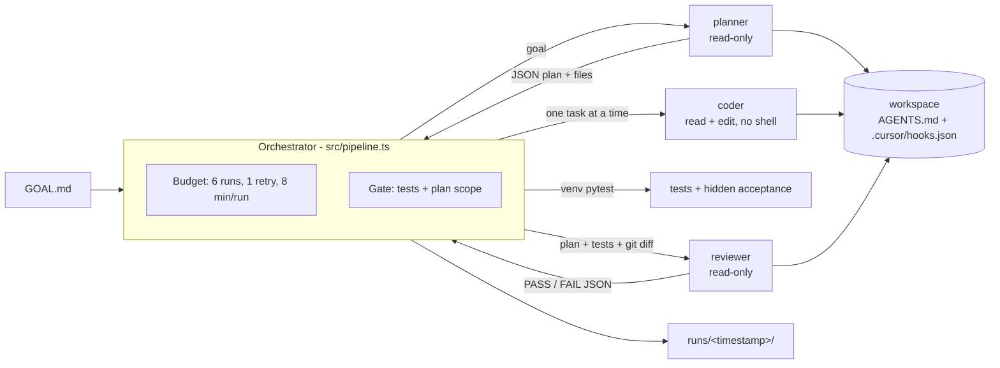

# cursor-multiagent-demo

A small, budgeted multi-agent workflow on top of the [Cursor TypeScript SDK](https://cursor.com/docs/api/sdk/typescript).
A TypeScript orchestrator drives three local Cursor agents (**planner**, **coder** and
**reviewer**) to build a tiny Python module from a one-line goal. `AGENTS.md` files govern how
the agents work, and a hook plus the orchestrator enforce the rules that matter.

The point is the engineering around the agents:
- least-privilege tool allowlists per role, with no shell for any agent
- a deterministic gate: tests, plus a check that only files declared in the plan changed
- strict run and retry budgets
- validated JSON contracts between roles
- trimmed, redacted, committed run logs

## Architecture



On FAIL, the coder gets the reasons and the test output for one retry, and the reviewer runs
once more. More detail is in [docs/architecture.md](docs/architecture.md). The decisions are in
the ADRs:
- [0001](docs/adr/0001-local-agents-over-cloud.md): local agents
- [0002](docs/adr/0002-run-budget.md): run budget
- [0003](docs/adr/0003-enforce-policy-in-hooks.md): enforce policy in hooks and the orchestrator,
  not prompts

## Repository layout

```text
src/                          orchestrator (pipeline, Cursor runner, gate, venv, logs, CLI)
prompts/                      planner.md, coder.md, reviewer.md
tests/                        vitest unit tests: scripted fake agent, real hook script, temp git repo
examples/target/              workspace 1 (textstats), own AGENTS.md and shell hook
examples/target-hidden-spec/  workspace 2 (durations), goal omits one requirement
examples/acceptance/          hidden acceptance tests, outside every workspace
runs/                         committed, trimmed logs of real runs
docs/                         architecture and ADRs
```

## Running it

Requirements: Node.js >= 22.13, Python 3.12+ with the `venv` module, and a Cursor user API key
(Dashboard -> API Keys). The orchestrator creates `<workspace>/.venv` and installs pytest
there. Agents never install anything.

```bash
npm ci
npm run format:check && npm run typecheck && npm test   # offline, no API calls

export CURSOR_API_KEY=...                               # never commit it
npm run pipeline                                        # examples/target; spends plan usage
npm run pipeline -- --workspace examples/target-hidden-spec \
  --acceptance examples/acceptance/target-hidden-spec
npm run pipeline -- --help
```

The pipeline refuses to start if the workspace has uncommitted changes, so the reviewed diff
contains only what the agents changed. `--timeout-min` and `--max-runs` tighten the budget. A
cap below the worst case is rejected.

## Cost notes

- Every run uses `composer-2.5` with `fast=false`. It is the cheapest model in Cursor's
  "Cursor Models" usage pool. At list price it costs $0.50 per 1M input tokens, $0.20 per 1M
  cache-read tokens and $2.50 per 1M output tokens
  ([pricing](https://cursor.com/docs/account/pricing)).
- SDK runs bill like IDE runs. A user API key draws from that user's plan, and the dashboard
  tags the usage "SDK". The printed cost is a list-price estimate of pool consumption, not an
  invoice. It assumes `inputTokens` excludes cache reads, which matches `totalTokens` being
  the sum of all four fields. The SDK's billed-cost call (`agent.getUsage()`) is not available
  on the account these runs used.
- A pipeline is capped at 6 agent runs. Each run gets a fresh agent, so context does not grow
  across roles. Most tokens are cache reads, because each tool-call turn sends the context
  again.

## Sample runs

Both runs used `composer-2.5`, `fast=false` and the default budget. The logs linked below hold
the prompt, every tool call (name + args, redacted and cut to 200 chars), the final text and
`summary.json`.

### Run 1: `examples/target`, PASS on first review

2026-10-04, 07:15 IST, logs in [`runs/2026-10-04T01-45-08Z/`](runs/2026-10-04T01-45-08Z/).
This run used the first version of the orchestrator, where the coder still had a shell.

| # | Run | Status | Total tokens | Input | Cache read | Output | Time |
|---|-----|--------|-------------:|------:|-----------:|-------:|-----:|
| 1 | planner | finished | 35,030 | 20,222 | 13,435 | 1,373 | 10.6 s |
| 2 | coder:T1 | finished | 194,612 | 101,640 | 90,411 | 2,561 | 23.4 s |
| 3 | coder:T2 | finished | 206,579 | 107,956 | 96,028 | 2,595 | 19.6 s |
| 4 | reviewer#1 | PASS | 41,661 | 24,799 | 15,756 | 1,106 | 8.0 s |
| | **Total (4 runs)** | **PASS** | **477,882** | 254,617 | 215,630 | 7,635 | 61.6 s |

Estimated cost: **$0.19**. Result: 10 tests pass.

### Run 2: `examples/target-hidden-spec`, FAIL then retry then PASS

2026-10-04, 07:39 IST, logs in [`runs/2026-10-04T02-09-42Z/`](runs/2026-10-04T02-09-42Z/).
This is the current orchestrator: no shell for any agent, venv interpreter, diff and scope gate.

| # | Run | Status | Total tokens | Input | Cache read | Output | Time |
|---|-----|--------|-------------:|------:|-----------:|-------:|-----:|
| 1 | planner | finished | 167,169 | 88,332 | 76,628 | 2,209 | 27.2 s |
| 2 | coder:T1 | finished | 130,366 | 68,834 | 57,429 | 4,103 | 27.6 s |
| 3 | coder:T2 | finished | 65,434 | 36,989 | 26,632 | 1,813 | 16.5 s |
| 4 | reviewer#1 | **FAIL** | 30,810 | 20,207 | 9,589 | 1,014 | 12.2 s |
| 5 | coder:fix1 | finished | 83,575 | 46,042 | 36,129 | 1,404 | 14.2 s |
| 6 | reviewer#2 | PASS | 249,915 | 131,817 | 115,512 | 2,586 | 25.4 s |
| | **Total (6 runs)** | **PASS** | **727,269** | 392,221 | 321,919 | 13,129 | 123.1 s |

Estimated cost: **$0.29**.

- **reviewer#1 FAILed.** Hidden test AC-3 (a bare number means minutes) failed, as intended.
  The reviewer pointed to `durations.py:37-39` and the gate added `test command exited with
  code 1`.
- **One retry fixed it.** `coder:fix1` made one edit and reviewer#2 PASSed. 26 tests pass:
  visible tests plus acceptance tests.
- **The hidden tests were reachable anyway.** The planner searched for them
  (`glob "**/*acceptance*"`) and reviewer#1 read the file from the path in the test output.
  Read tools are not confined to the workspace. "Hidden" here means the tests are not in the
  workspace or in the planner and coder prompts, not that the agents cannot read them.
- **The shell hook was not exercised.** No role was offered a shell, so no agent shell command
  reached `beforeShellExecution`. The hook is defence in depth. Its behaviour is covered by
  unit tests that run the real script, not by this run.

### What went wrong in run 1, and what changed

In run 1 the coder's shell did not inherit the orchestrator's `PATH`, so `python3` was the
system interpreter, which has no pytest. The coder then ran
`pip3 install pytest --break-system-packages` and attempted `apt-get install`. AGENTS.md and
the coder prompt both forbade this, and the reviewer, reading only files, could not see it.
Prompts are guidance, not enforcement. The fixes, one commit each:

1. **Shell allowlist hook.** `.cursor/hooks.json` registers `beforeShellExecution` with
   `failClosed: true`. It allows only `python3` or venv-python `-m pytest|compileall`. Tests
   replay run 1's three escape commands and fail if the hook is removed.
2. **Absolute interpreter.** The orchestrator creates `<workspace>/.venv`, installs pytest
   itself and runs `<abs>/.venv/bin/python -m pytest`.
3. **No shell for the coder.** It gets read and edit only, as an allowlist.
4. **A goal that fails first.** `examples/target-hidden-spec` plus hidden acceptance tests
   exercise the retry path (run 2).
5. **Tool calls in the logs.** Each call is logged with its truncated args, so a violation like
   run 1's is visible. Secrets are redacted before truncation.
6. **Diff and scope gate.** The reviewer sees `git status` and `git diff` for the workspace.
   Any changed file that is not in the plan's declared `files` forces FAIL in TypeScript.

Still open: reads outside the workspace (a `beforeReadFile` hook could confine them), and
confirming that the SDK actually loads project hooks for local agents. That needs a run where
a role has a shell, which this design avoids on purpose.

## License

MIT
