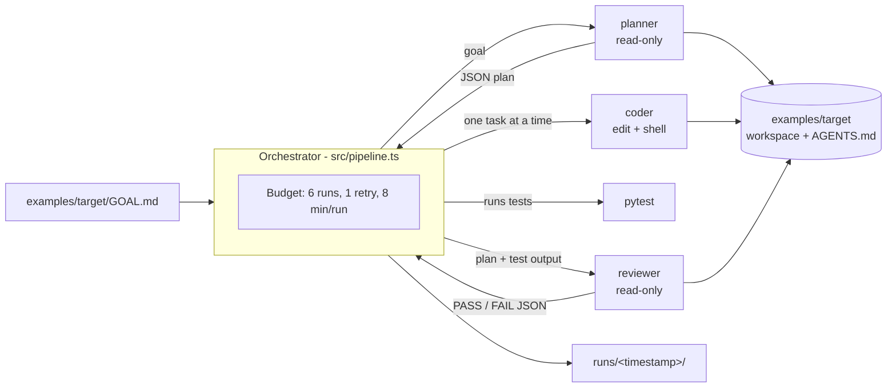

# cursor-multiagent-demo

A small, budgeted multi-agent workflow on top of the [Cursor TypeScript SDK](https://cursor.com/docs/api/sdk/typescript).
A TypeScript orchestrator drives three local Cursor agents (**planner**, **coder** and
**reviewer**) to build a tiny Python module from a one-line goal. `AGENTS.md` files govern how
the agents work.

The point is the engineering around the agents: least-privilege tool policies per role, a
deterministic test gate, strict run and retry budgets, validated JSON contracts between roles,
and trimmed, committed run logs.

## Architecture



On FAIL, the coder gets the reviewer's reasons and one retry, then the reviewer runs once more.
More detail is in [docs/architecture.md](docs/architecture.md). The design decisions are in
[ADR 0001](docs/adr/0001-local-agents-over-cloud.md) (local agents) and
[ADR 0002](docs/adr/0002-run-budget.md) (budget).

## Repository layout

```text
src/              orchestrator (pipeline, Cursor runner, parsers, budget, logging, CLI)
prompts/          planner.md, coder.md, reviewer.md
tests/            vitest unit tests with a scripted fake agent (no network)
examples/target/  the workspace the agents build in, with its own AGENTS.md
runs/             committed, trimmed logs of real runs
docs/             architecture and ADRs
```

## Running it

Requirements: Node.js >= 22.13, Python 3.12+ with pytest (for the example target), and a
Cursor user API key (Dashboard -> API Keys).

```bash
npm ci
npm run format:check && npm run typecheck && npm test   # offline, no API calls

export CURSOR_API_KEY=...                               # never commit it
npm run pipeline                                        # spends plan usage
npm run pipeline -- --help
```

Optional: `TARGET_TEST_CMD` overrides the test command (default `python3 -m pytest -q`), and
`--timeout-min` / `--max-runs` tighten the budget. A cap below the worst case is rejected.

## Cost notes

- Every run uses `composer-2.5` with `fast=false`. It is the cheapest model in Cursor's
  "Cursor Models" usage pool. At list price it costs $0.50 per 1M input tokens, $0.20 per 1M
  cache-read tokens and $2.50 per 1M output tokens
  ([pricing](https://cursor.com/docs/account/pricing)).
- SDK runs bill like IDE runs. A user API key draws from that user's plan, and the dashboard
  tags the usage "SDK". The cost printed at the end is a list-price estimate of pool
  consumption, not an invoice.
- A pipeline is capped at 6 agent runs. Each run gets a fresh agent, so context does not grow
  across roles.

## Sample run

TBD (not run yet).

## License

MIT
