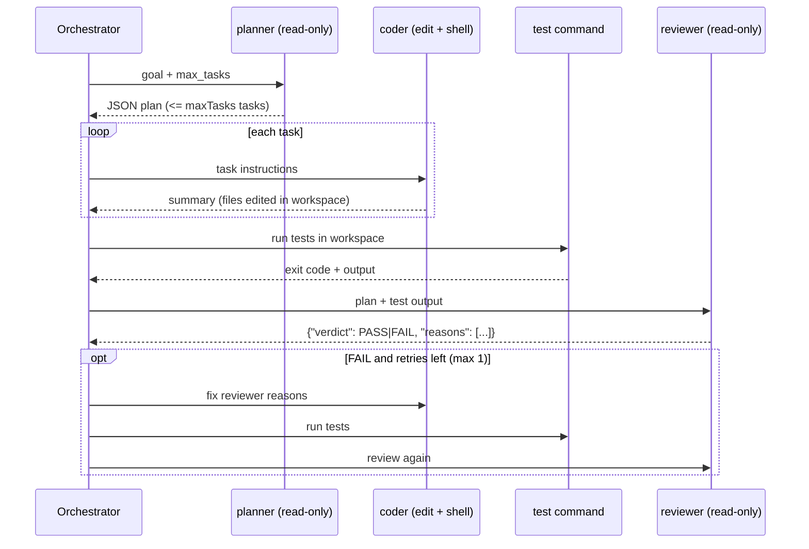

# Architecture

## Components

| Module | Responsibility |
|--------|----------------|
| `src/cli.ts` | Entry point. Reads `GOAL.md`, builds the budget, wires the real runner, writes logs. |
| `src/pipeline.ts` | Control flow: plan, code each task, test, review, at most one fix round. Pure orchestration over interfaces. |
| `src/cursor-runner.ts` | The only module that calls `@cursor/sdk` at runtime. One fresh local agent per role run. |
| `src/roles.ts` | Tool policy per role (allowlist / denylist of SDK built-in tools). |
| `src/parse.ts` | Extracts and validates the planner plan and reviewer verdict from model text. |
| `src/budget.ts`, `src/config.ts` | Run cap, retry limit, timeouts, model selection, list prices. |
| `src/test-runner.ts` | Runs the target's test command; its exit code is the deterministic gate. |
| `src/run-log.ts` | Writes trimmed per-run markdown logs and `summary.json`. |
| `prompts/*.md` | One template per role, `{{placeholder}}` substitution, unknown placeholders fail. |

## Flow

## Key properties

- **Bounded cost.** The run cap is checked against the worst case before the first run
  (`1 + maxTasks + 1 + 2 * maxRetries <= maxRuns`, 6 with defaults) and enforced again before
  every run. There is no loop that is not bounded by the budget.
- **Deterministic gate.** The orchestrator runs the tests itself. A reviewer PASS with a
  non-zero test exit code is converted to FAIL (`gateReview`).
- **Least privilege.** Planner and reviewer get `read`, `grep`, `glob`, `ls` only. The coder
  keeps edit and shell but loses web, MCP, subagents, and delete.
- **Fresh context per run.** Each role run is a new `Agent.create` call, so prompts stay small
  and every run can be reproduced from its logged prompt.
- **Governance through files.** Agents run with `local.cwd` set to the target workspace and
  `settingSources: ["project"]`; every prompt also tells the agent to read the workspace
  `AGENTS.md` first.
- **Small logs.** Only prompt, tool-call names, final text, and usage are kept per run.

## Failure handling

| Situation | Outcome |
|-----------|---------|
| Agent run ends `error` / `cancelled` (incl. timeout) | `ERROR`, no further runs |
| Planner or reviewer output is not valid JSON of the expected shape | `ERROR` |
| Run cap reached | `BUDGET_EXHAUSTED` |
| Reviewer FAIL after the retry | `FAIL` |
