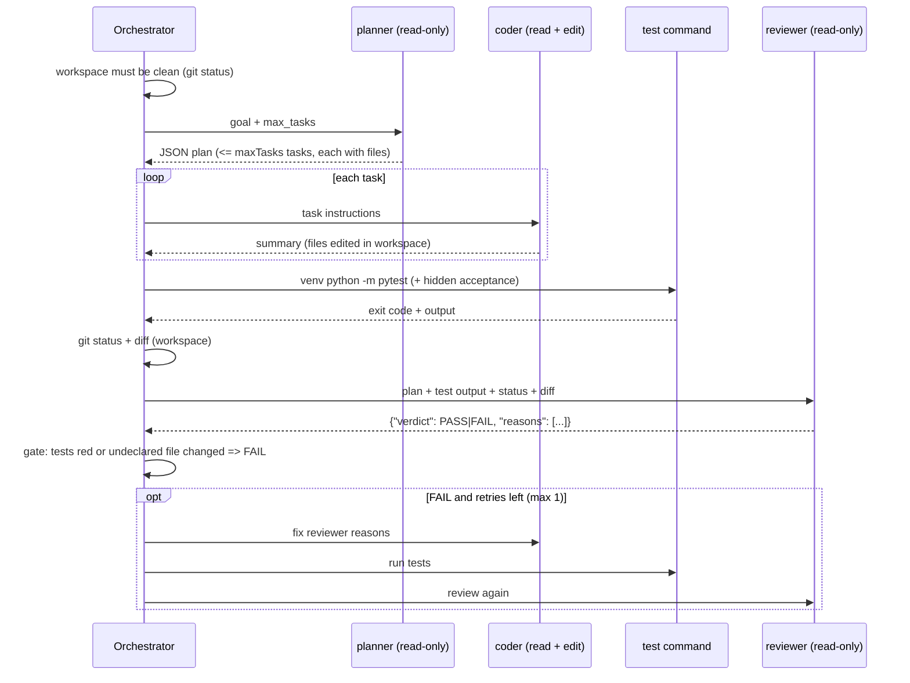

# Architecture

## Components

| Module | Responsibility |
|--------|----------------|
| `src/cli.ts` | Entry point. Reads `GOAL.md`, builds the budget, wires the real runner, writes logs. |
| `src/pipeline.ts` | Control flow: plan, code each task, test, review, at most one fix round. Pure orchestration over interfaces. |
| `src/cursor-runner.ts` | The only module that calls `@cursor/sdk` at runtime. One fresh local agent per role run. Records each tool call with its args. |
| `src/roles.ts` | Tool allowlist per role. No role has a shell; only the coder can edit. |
| `src/parse.ts` | Extracts and validates the planner plan (incl. declared `files`) and reviewer verdict. |
| `src/budget.ts`, `src/config.ts` | Run cap, retry limit, timeouts, model selection, list prices. |
| `src/test-runner.ts` | Creates/reuses `<workspace>/.venv`, installs pytest, runs tests with the absolute venv python (plus optional hidden acceptance tests). |
| `src/workspace.ts` | `git status --porcelain` / `git diff` scoped to the workspace, and the plan-scope check. |
| `src/redact.ts`, `src/tool-calls.ts` | Secret redaction and tool-arg truncation for logs. |
| `src/run-log.ts` | Writes trimmed, redacted per-run markdown logs and `summary.json`. |
| `examples/*/.cursor/hooks.json` | `beforeShellExecution` allowlist hook (defence in depth, see ADR 0003). |
| `prompts/*.md` | One template per role, `{{placeholder}}` substitution, unknown placeholders fail. |

## Flow

## Key properties

- **Bounded cost.** The run cap is checked against the worst case before the first run
  (`1 + maxTasks + 1 + 2 * maxRetries <= maxRuns`, 6 with defaults) and enforced again before
  every run. There is no loop that is not bounded by the budget.
- **Deterministic gate.** The orchestrator runs the tests itself with the workspace venv's
  absolute interpreter. `gateReview` turns a reviewer PASS into FAIL when the tests exit
  non-zero or when `git status` shows a changed file the plan did not declare.
- **Least privilege.** Planner and reviewer get `read`, `grep`, `glob`, `ls`. The coder adds
  `edit`. No role has a shell, so agents never choose commands. A fail-closed
  `beforeShellExecution` hook in each workspace allowlists `python -m pytest|compileall` in
  case a shell is ever re-enabled (ADR 0003).
- **Clean baseline.** The pipeline refuses to start on a dirty workspace, so the diff is
  exactly the agents' work.
- **Fresh context per run.** Each role run is a new `Agent.create` call, so prompts stay small
  and every run can be reproduced from its logged prompt.
- **Governance through files.** Agents run with `local.cwd` set to the target workspace and
  `settingSources: ["project"]`; every prompt also tells the agent to read the workspace
  `AGENTS.md` first.
- **Small, redacted logs.** Per run: the prompt, each tool call with args cut to 200 chars, the
  final text, and usage. Everything is redacted first (secret env values and token patterns).
- **Known gap.** Read tools are not confined to the workspace. In run 2 the planner globbed
  for the hidden acceptance tests.

## Failure handling

| Situation | Outcome |
|-----------|---------|
| Agent run ends `error` / `cancelled` (incl. timeout) | `ERROR`, no further runs |
| Planner or reviewer output is not valid JSON of the expected shape | `ERROR` |
| Run cap reached | `BUDGET_EXHAUSTED` |
| Workspace dirty before the first run | `ERROR`, no agent runs |
| Tests red or undeclared file changed | reviewer verdict forced to `FAIL` |
| Reviewer FAIL after the retry | `FAIL` |
