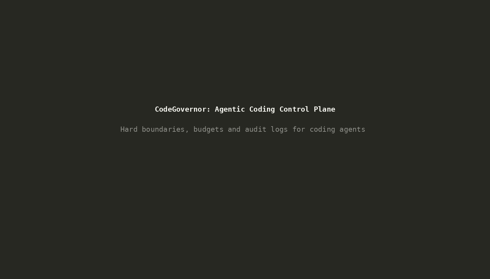

# Demo: replay of a recorded run



The demo replays the committed run 2 ([`runs/2026-10-04T02-09-42Z/`](../runs/2026-10-04T02-09-42Z/))
through the current pipeline code. It makes no model calls, needs no API key and does not
touch any workspace.

```bash
npm run demo:replay                     # FAIL, one retry, PASS, as recorded
npm run demo:replay -- --check-paths    # same recording, with the current coder path check
npm run demo:replay -- --help
```

## What is real and what is replayed

Real, the same code a live run uses:

- `runPipeline` in `src/pipeline.ts`: run order, the run budget, the retry loop, the
  duplicate-failure check and the gate.
- Budget pre-flight (`worstCaseRuns`, `validateBudget` in `src/config.ts`).
- Plan and verdict parsing (`src/parse.ts`), the plan-scope gate (`src/workspace.ts`), the
  coder path check (`src/tool-scope.ts`), redaction and truncation of tool-call args.
- The prompts in `prompts/` are rendered for every run, then ignored by the fake agent.

Replayed from the logs (`src/replay.ts`):

- Each agent run: final text, tool calls, token usage and duration come from
  `runs/<ts>/NN-<label>.md`. The fake runner fails if the pipeline asks for a run in a
  different order than the recording, so a successful replay means the current pipeline
  requests exactly the recorded sequence.
- Test results: the exit code for each review comes from the gate reason recorded in
  `summary.json` (`test command exited with code 1` for review 1, none for review 2). Only
  the last test output was recorded (`tests.txt`). Tests are not executed.
- Changed files: run 2 did not log `git status`, so the changed files are taken from the
  coders' recorded `edit` calls (`durations.py`, `tests/test_durations.py`).
- Time: each run waits its recorded duration divided by `--speed` (default 8).

## `--check-paths`

Run 2 predates path capture, so by default its tool calls carry no `paths` and the coder path
check has nothing to inspect. With `--check-paths`, the replay gives `read`, `edit`, `grep` and
`ls` calls the absolute path that was logged as their detail. The current pipeline then stops
before reviewer#2: `coder:fix1` grepped the repository root, outside the workspace, which is a
policy violation with no retry. That is the outcome the current orchestrator would have
produced for this run.

## The video

The recording predates rule IDs. Step 3 in the GIF shows the hook denying
`pip3 install pytest --break-system-packages` with
`Blocked by shell_policy hook: --break-system-packages is forbidden`; the same command now
returns
`CG-SHELL-002 NO_SYSTEM_PACKAGES: --break-system-packages is a system package install. See AGENTS.md section 3 (Commands).`

`docs/media/demo.gif` is a terminal recording of [`scripts/demo-session.sh`](../scripts/demo-session.sh):

1. Title card.
2. `npm test` summary (offline unit tests).
3. The real `shell_policy.py` hook denying `pip3 install pytest --break-system-packages`, the
   command a coder ran in run 1, fed as JSON on stdin.
4. `npm run demo:replay` on run 2.
5. `npm run demo:replay -- --check-paths`, showing the policy-violation outcome.

Recorded with asciinema 2.4.0 and rendered with agg 1.9.0:

```bash
asciinema rec -c "bash scripts/demo-session.sh" --cols 112 --rows 27 demo.cast
agg --font-family "DejaVu Sans Mono" --font-size 22 --theme monokai \
  --idle-time-limit 12 --fps-cap 15 --last-frame-duration 3 demo.cast docs/media/demo.gif
```
